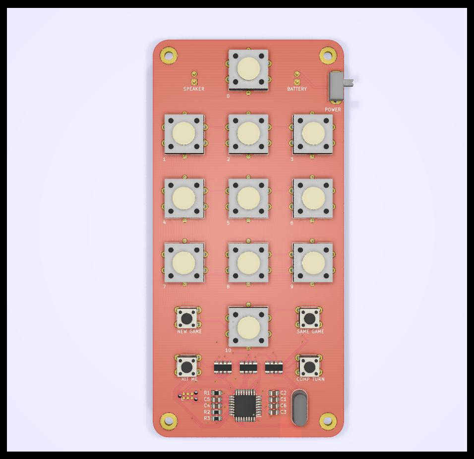
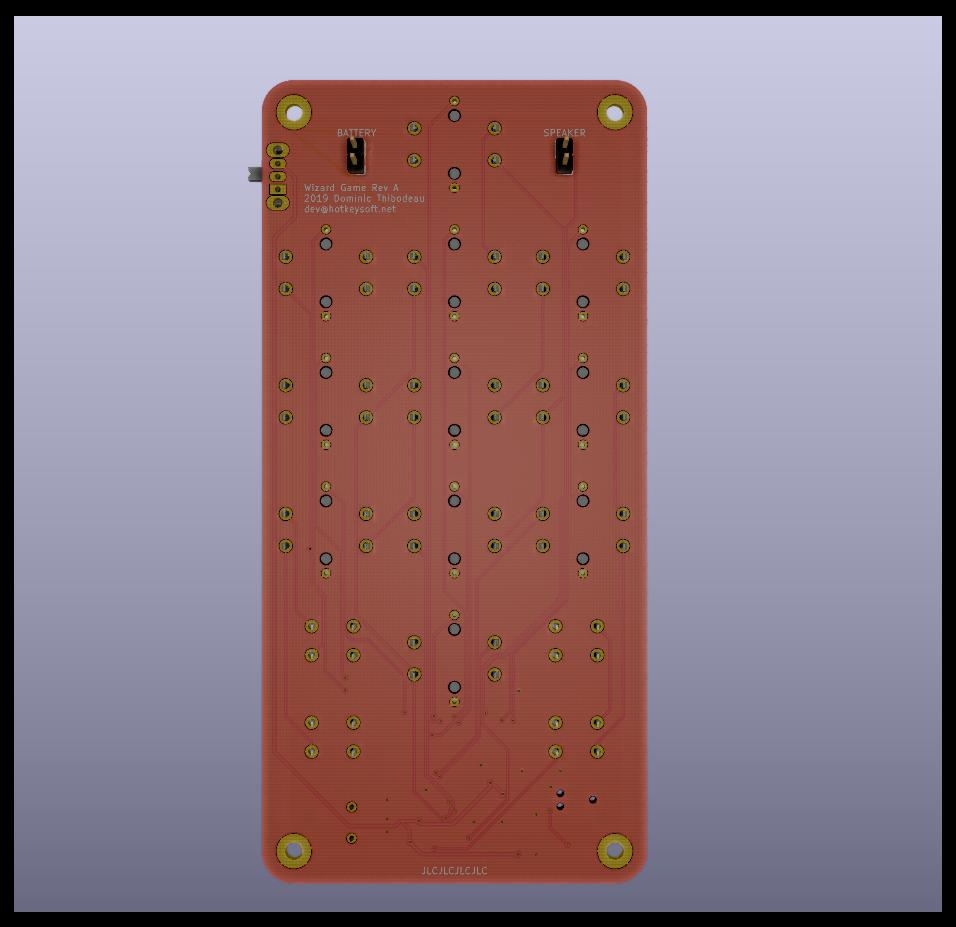
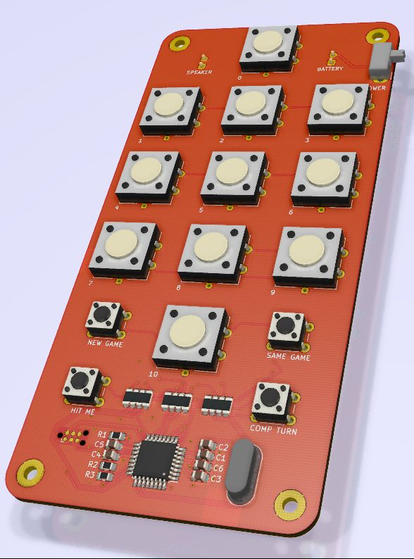

# Wizard Electronic Game
Rev A October 2019

### Handheld Electronic Game
- ATmega328P microcontroller running at 12MHz
- 10 push buttons with red LEDs
- 4 buttons for game mode
- Buzzer
- Tag-Connect for programming
- Runs on 3 AAA batteries

The microcontroller runs a [TMS1000-series emulator](https://github.com/hotkeysoft/emulators) I made.

Two ROMs are loaded on the emulator: **Merlin (TMS1100)** and **Master Merlin (TMS1400)** (by *Parker Brothers*).

By default the game boots in Merlin mode. To play Master Merlin, press any of the four mode buttons while turning on the console.

Images
============
|Front                                                 | Back                                              |
|------------------------------------------------------|---------------------------------------------------|
|||

### Schematics (pdf)
- [Complete schematics](./img/schema.pdf)

### PCB Images (svg)
- [Top](./img/pcb-front.svg)
- [Bottom](./img/pcb-back.svg)
